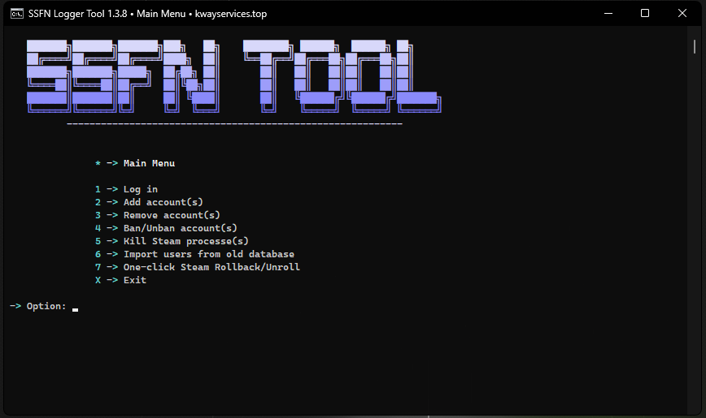

# Steam SSFN Loader 🚂

Welcome to the Steam SSFN Loader, a powerful tool designed to streamline your Steam experience!

## 🌟 Features

- **SSFN File Loading**: Easily log in with SSFN files directly into your Steam client.
- **Integrated Logging**: Get live feedback on what the tool is doing with the integrated Logger.
- **Rollback Utility**: Rollback and unroll your Steam client with ease using our one-click method.
- **And more!**

## 📜 Prerequisites

Before you get started with the Steam SSFN Loader, ensure you have:

- Windows 7/8/10 or newer.
- Python 3.8+ installed.
- Admin rights on your computer (for some features).

## 💡 Contributing

We welcome contributions! If you've found a bug or have a feature request, please open an issue. If you'd like to contribute code, please open a pull request.

## 📝 License

This project is licensed under the MIT License. See the [LICENSE](LICENSE) file for details.

## 💜 Credits
https://github.com/bet3rd/ssfnlogger - for the idea